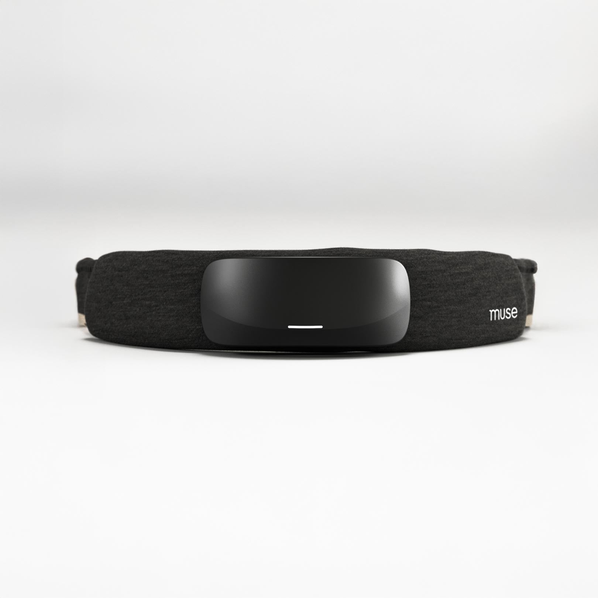
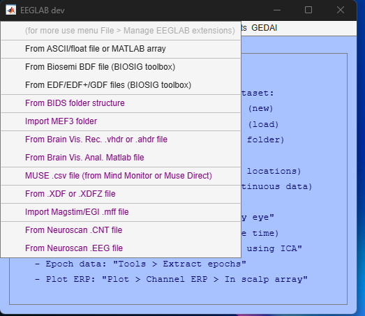
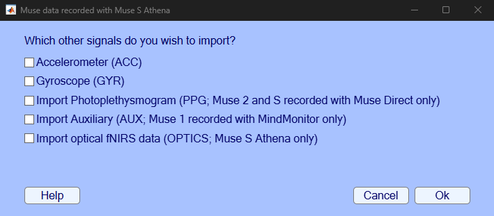
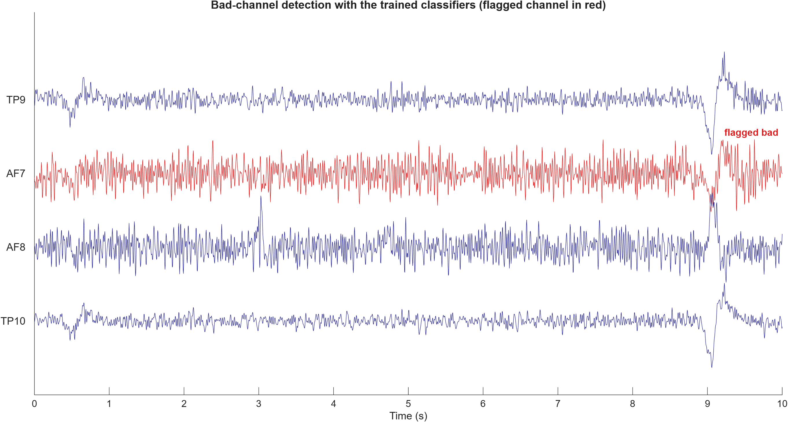

# import_muse EEGLAB plugin

EEGLAB plugin importing Muse .csv recordings from the **Mind Monitor**, **Muse Direct**, and **Muse Lab (OpenMuse)** Apps. Compatible with **Muse 1 (2014 & 2016), Muse 2, Muse S, and Muse S Athena** (including the Athena's raw optical/fNIRS data). Data are automatically converted to the EEGLAB format, giving access to EEGLAB's tools (filtering, ICA, clean_rawdata, LIMO...).

Non-EEG channels (Accelerometer, Gyroscope, Photoplethysmogram, Auxiliary, and the Athena's optical fNIRS data) can be imported along with the EEG data.

<p align="center">
  
</p>

## Graphic interface

Import menu: **File → Import data → MUSE .csv file (from Mind Monitor or Muse Direct)**



Optional signal selection dialog:



## Usage

```matlab
EEG = import_muse;                               % GUI: select a file and the optional signals
EEG = import_muse(filepath);                     % import EEG (command line)
EEG = import_muse(filepath, 'optics');           % EEG + Athena fNIRS optical data
EEG = import_muse(filepath, 'acc', 'gyr', 'aux', 'ppg'); % import everything
EEG = import_muse(filepath, 'detectBadChan');    % EEG + flag bad channels (reported, not removed)
EEG = import_muse(filepath, 'reref');            % EEG + frontal channels re-referenced to linked mastoids (TP9+TP10)
```

Supported file formats (auto-detected):

| Recording app | File layout | EEG | Extras |
|---|---|---|---|
| Mind Monitor (Muse 1/2/S) | `TimeStamp` + `RAW_TP9...` + band powers | 256 Hz | ACC, GYR, AUX |
| Muse Direct (Muse 1/2/S) | `timestamps` + `eeg_1..6` + band powers | 256 Hz | ACC, GYR, PPG |
| Muse Direct (Muse S **Athena**) | `Timestamp`, `PacketType`, `Data` packets | 256 Hz | ACC, GYR, OPTICS (fNIRS) |
| Muse Lab / OpenMuse (**Athena**) | `timestamp`, `osc_address`, `osc_type`, `osc_data` | 256 Hz | ACC, GYR, OPTICS |
| Athena EEG export | `ts`, `TP9`, `AF7`, `AF8`, `TP10` | 256 Hz | — |
| Athena optics export | `ts`, `ch1..ch16` | — | OPTICS only (64 Hz) |

Files containing only band power / session scores (no raw EEG) are rejected with a clear error message.

## Tutorial: basic steps

1. Start EEGLAB, then import a file from the menu: **File → Import data → MUSE .csv file (from Mind Monitor or Muse Direct)**; pick the optional signals in the dialog (or skip the dialog and use the command line below).
2. Browse the imported data: **Plot → Channel data (scroll)**. The 4 EEG channels (`TP9, AF7, AF8, TP10`) plus any optional channels you selected (ACC, GYR, PPG, AUX, fNIRS optics) appear in the EEGLAB structure.
3. Preprocess as with any EEG dataset, e.g. filter 1–45 Hz (**Tools → Filter data → Basic FIR filter**; a 45 Hz low-pass keeps European 50 Hz line noise out of your analysis band), reject bad data automatically (**Tools → Reject data using Clean Rawdata and ASR**), or run ICA (**Tools → Run ICA**).
4. Flag bad channels with the trained classifiers: import with `EEG = import_muse(filepath, 'detectBadChan');`, or on an already imported EEG run `[badChan, badChanLabels] = scan_channels(EEG, 0.5, 1);` (see next section).
5. Analyze heart signals: if you imported the PPG channel (Muse 2/S recorded with Muse Direct) or recorded ECG separately, use the [BrainBeats](https://github.com/amisepa/BrainBeats) EEGLAB plugin to process heartbeat-evoked potentials (HEP), extract EEG and HRV features (SDNN, RMSSD, LF/HF power...), remove heart artifacts from the EEG, and compute brain-heart coherence: [BrainBeats tutorial](https://eeglab.org/plugins/BrainBeats).

## Athena optical (fNIRS) data

The Muse S Athena has a PPG/fNIRS optical sensor strip with 5 optodes over the left and right prefrontal cortex, recording at 64 Hz. Depending on the recording preset, the OPTICS packets contain 4, 8, or 16 data values per sample (wavelengths 730 nm, 850 nm, and red 660 nm, plus ambient-light readings). The plugin imports these values raw; when the full 16-value layout is present, channels are named by sensor position and wavelength (Mind Monitor mapping):

- 16 values: `LO_730, RO_730, LO_850, RO_850, LI_730, RI_730, LI_850, RI_850, LO_Red, RO_Red, LO_Amb, RO_Amb, LI_Red, RI_Red, LI_Amb, RI_Amb` (LO/LI = left outer/inner sensor, RO/RI = right outer/inner; Amb = ambient light)
- 8 values: inner + outer 730/850 nm
- 4 values: inner sensors only (`LI_730, RI_730, LI_850, RI_850`)
- Other layouts are imported as `Opt1...OptN`

When imported together with the EEG with the `'optics'` flag, optical channels are resampled (nearest-neighbor) onto the 256 Hz EEG time grid; optics-only files are returned at their native 64 Hz rate.

## Flag bad channels using trained classifiers

```matlab
EEG = import_muse(filepath, 'detectBadChan');
% or, on an already imported (raw, unfiltered) EEG:
[badChan, badChanLabels] = scan_channels(EEG, 0.5, 1);
```

The input EEG must be raw (no prior preprocessing); it is band-pass filtered 1-45 Hz on the fly (the training filter, with a 45 Hz low-pass that excludes European 50 Hz line noise) for classification (the output EEG remains raw). `maxTol` (second argument, default 0.5) is the portion of bad 5-s windows tolerated before a channel is flagged; with the default, up to half of the 5-s windows may be bad before the channel is flagged - set it lower (e.g. 0.33) to be stricter.

For each 5-s window, features are computed in the time, frequency, and nonlinear domains (RMS, SNR, low-frequency power, kurtosis, high-frequency power...), selected as most important by a Random Forest during model training.

### How the models were built and validated

I manually labeled 3,000 30-second EEG segments recorded with MUSE headsets as good or bad, and extracted features in the time, frequency, and nonlinear domains. I then trained an ensemble of machine learning models (decision trees, logistic regression, LDA, SVM, Naive Bayes, neural networks) with feature selection, PCA dimension reduction, hyperparameter tuning, and 5-fold cross-validation (on 80% of the data). The best model was validated on remaining data from 20% (different subjects, to avoid overfitting). The best models reached 93.5% accuracy for the frontal channels (logistic regression) and 91.4% for the posterior channels (decision tree). The classifiers are conservative: on clean recordings they can still flag a channel, so verify the results with `scan_channels(EEG, maxTol, 1)` (visualization on) when in doubt.

Flagged channels are reported, not removed automatically: check them visually (e.g. Plot > Channel data scroll; the classifiers run on the data band-pass filtered 1-45 Hz on the fly (the training filter, with a 45 Hz low-pass that excludes European 50 Hz line noise), the same filter as used for training), remove the channels you confirm are bad (e.g. `EEG = pop_select(EEG, 'nochannel', {'AF7'});`), and re-run or re-reference as needed.

Example output on a real eyes-open recording (fa5b9609ba, muse_biosemi study): the AF7 channel is flagged bad (drawn in red by the built-in visualization) while TP9, AF8, and TP10 are kept:



### Frontal re-referencing to linked mastoids

`EEG = import_muse(filepath, 'reref');` (or add `'reref'` to any other option) re-references the frontal channels (AF7, AF8) to the linked mastoids (average of TP9 and TP10), the standard reference for frontal alpha asymmetry with 4-channel headsets. Before re-referencing, both TP channels must pass the trained classifiers: if a TP channel is flagged bad (or missing), the import reports that linked-mastoids re-referencing is **not possible for this dataset** and leaves the data unreferenced, since a bad mastoid reference would corrupt the frontal signals. Check the flagged channels visually, remove those you confirm are bad, and re-import with `'reref'`. The TP channels keep their own raw signals in the output.

## Reference

If you use this plugin, please cite the signal validation study:

> Cannard, C., Wahbeh, H., & Delorme, A. (2021). Validating the wearable MUSE headset for EEG spectral analysis and Frontal Alpha Asymmetry. *2021 IEEE International Conference on Bioinformatics and Biomedicine (BIBM)*, 3603-3610. [https://doi.org/10.1109/BIBM52615.2021.9669778](https://ieeexplore.ieee.org/document/9669778)

The study shows the MUSE can be used to examine power spectral density in all frequency bands, the individual alpha frequency, and frontal alpha asymmetry, with satisfying internal consistency reliability, compared to a research-grade 64-channel BIOSEMI system.

If this plugin does not work for you, see also this other independent implementation for [importing Muse data](https://github.com/sccn/eeglab_musemonitor_plugin).

## Version history

- v2.3 - added linked-mastoids re-referencing option ('reref'): AF7/AF8 re-referenced to the average of TP9 and TP10, after both TP channels pass the trained classifiers
- v2.2 - Muse S Athena support (packet, OSC log, EEG-only, and optics-only exports; 4/8/16 fNIRS optical channels); rewritten file parsing and sampling rate detection (fixed Mind Monitor rate errors); hour rollover support for legacy MindMonitor files; fixed command-line import crash, classifier output handling, bad-channel flagging with extra channels, and ACC/GYR amplitude scaling
- v2.1 - bug fixes
- v1.1 - added trained classifiers to flag bad channels
- v1.0 - Plugin created and available - June 7, 2021